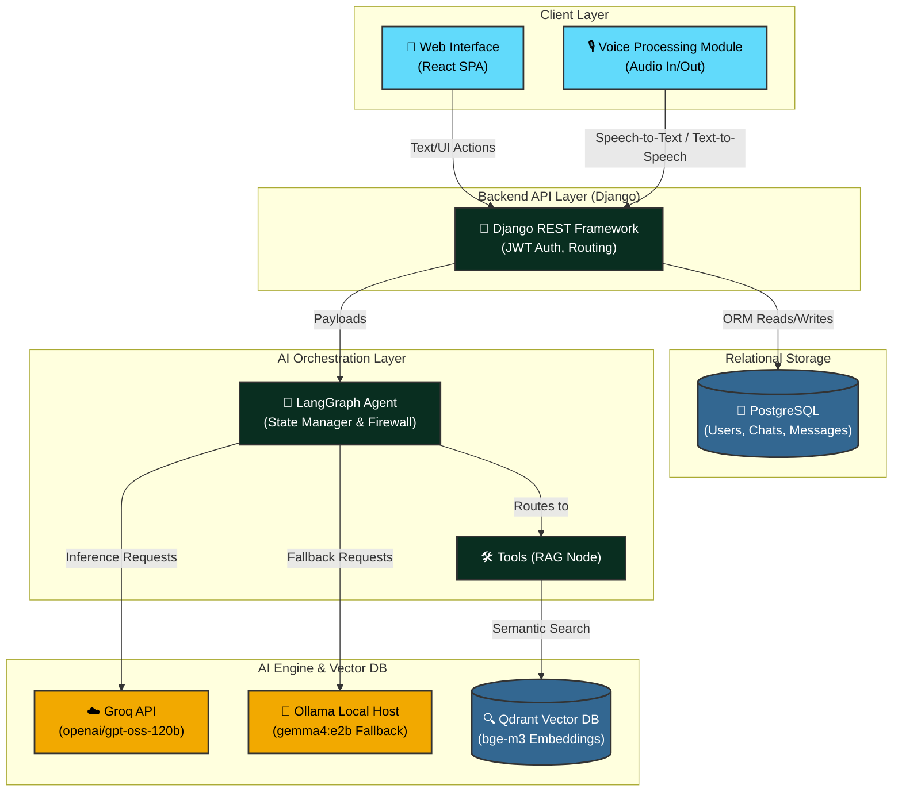
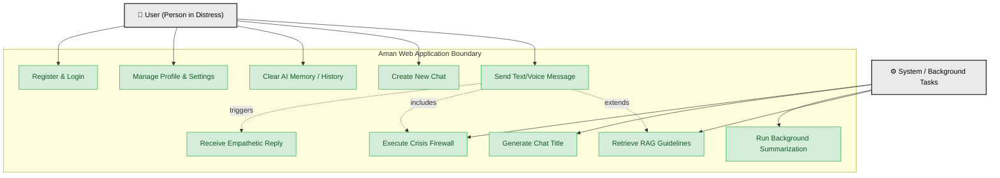
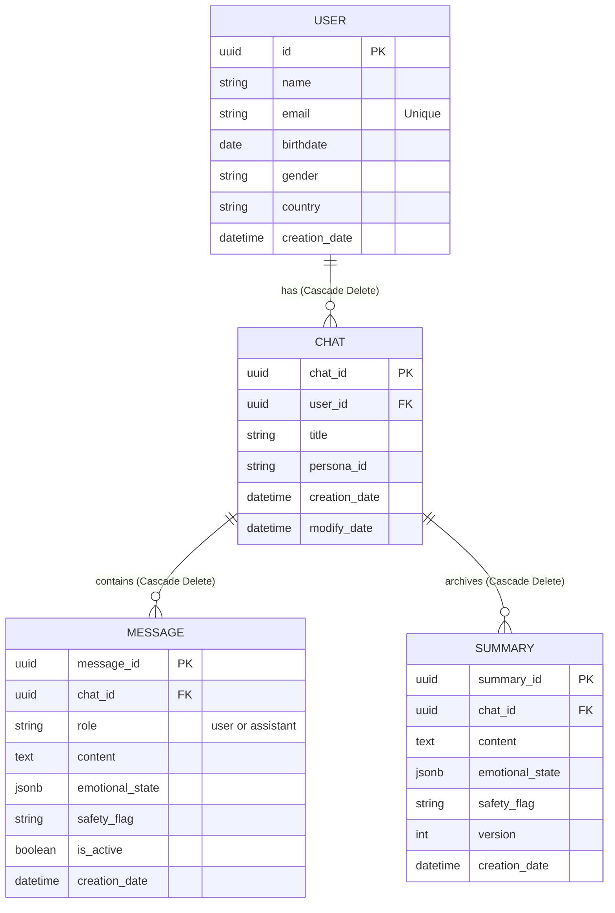
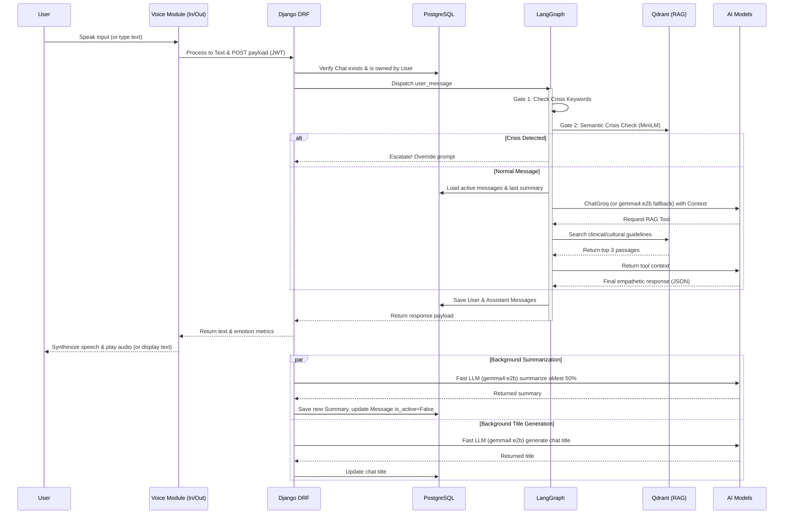

# Aman: AI-Powered Emotional Wellness Agent - System Diagrams

These diagrams reflect the finalized system architecture, replacing the legacy concepts. You can render these diagrams by pasting the code blocks into [Mermaid Live Editor](https://mermaid.live/) or directly including them in markdown viewers that support Mermaid (like GitHub or Notion).

## 1. System Architecture Diagram

This diagram shows the high-level interaction between the React Frontend, Django API, LangGraph Orchestrator, and the AI/Database layers.

## 2. Use Case Diagram

This diagram maps what the primary actor (the User) and the System can do, rendered as a compatible Mermaid flowchart.

## 3. Class & Entity Relationship Diagram (Database Schema)

This defines how the relational database is structured, showcasing the cascading rules.

## 4. Sequence Diagram (Message Flow & Firewall)

This shows the chronological flow of data when a user sends a message.

