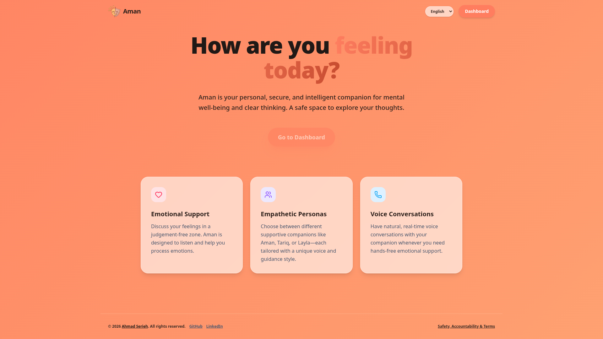
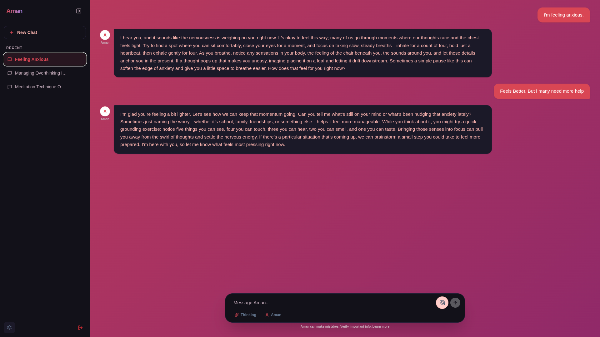
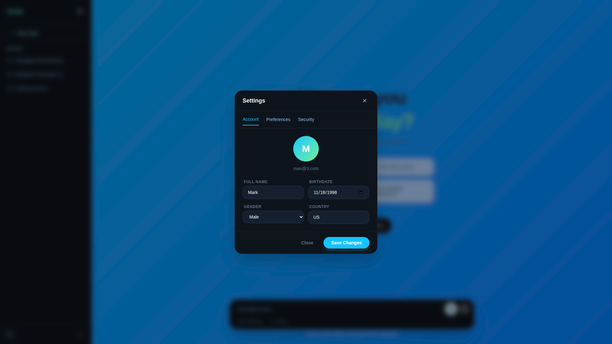

# Aman



Aman (أمان — *safety*, *peace*) is a multimodal, bilingual (Arabic-English) mental health companion designed to provide culturally sensitive support for the Middle East and North Africa (MENA) region. It offers a calm space to talk, reflect, and feel heard, operating strictly within safe clinical boundaries. 

This repository contains the complete stack: a React + Vite web application, a Django backend, and an AI orchestration layer powered by LangGraph, Qdrant, and local safety classifiers.




## Recognition 🏆
- **Best Graduation Project:** Notied as the top project with distinction among all graduation projects at the IT Faculty of [Al-Ahliyya Amman University](https://www.ammanu.edu.jo/) (2026).
- **NTP Competition 2026:** Proud competitor and participant in the National Technology Parade (NTP) 2026.

## Key Features

- **Multimodal Chat**: Supports text and asynchronous or live voice conversation modes.
- **Cultural Alignment**: Evaluates and responds to distress using Arabic dialects (Levantine) and cultural context, rather than strictly Western psychiatric frameworks.
- **Two-Stage Safety Firewall**: Screens inputs for active crisis indicators (RED flag) and culturally sensitive topics (GRAY flag) using local Sentence-Transformer embeddings, escalating to de-escalation protocols when necessary.
- **Clinically Grounded (RAG)**: Retrieves guidance from a curated vector database (including WHO reports and the Shifaa corpus) to prevent hallucinations and unsupported medical claims.
- **Long-Term Memory**: Extracts and recalls biographical facts across sessions for signed-in users, maintaining continuity.
- **Guest Mode**: Allows users to chat anonymously with all history kept in local browser storage.

## Architecture Overview

Aman is built using a modular multi-agent framework rather than a single unrestricted language model call. 


- **Frontend (`Frontend/`)**: React 19, Vite, Tailwind CSS v4, Zustand.
- **Backend (`Backend/`)**: Django 6.0 (REST Framework) with Daphne/Channels for WebSocket streaming.
- **AI Orchestration**: LangGraph routes inputs through perception, safety, retrieval, memory, and generation agents.
- **Data Stores**: PostgreSQL (relational data) and Qdrant (semantic vector storage).
- **Models**: Groq (`gpt-oss-120b`) for generative reasoning, [`bge-m3`](https://huggingface.co/BAAI/bge-m3) for clinical retrieval embeddings, [`all-MiniLM-L6-v2`](https://huggingface.co/sentence-transformers/all-MiniLM-L6-v2) for the low-latency safety firewall, and [`multilingual_go_emotions`](https://huggingface.co/AnasAlokla/multilingual_go_emotions) for emotion detection.

For a detailed breakdown of the system design, evaluation metrics, and setup instructions, please refer to the [Documentation Directory](Documentation/index.md).

## Getting Started

### Prerequisites
- **Python 3.11+** (using `uv` for package management)
- **Node.js 20+**
- **Docker** and **Docker Compose** (for PostgreSQL and Qdrant)

### Quick Start
1. Clone the repository and copy the environment template:
   ```bash
   cp .env.example .env
   ```
2. Fill in the required keys in `.env` (e.g., `GROQ_API_KEY`, `SECRET_KEY`).
3. Run the development stack using the provided Makefile:
   ```bash
   make dev
   ```
4. Access the application at `http://localhost:5173`.

*For detailed installation and production build instructions, see [Setup and Deployment](Documentation/Setup_and_Deployment.md).*

## Documentation

Comprehensive guides covering system architecture, safety mechanisms, data pipelines, and deployment can be found in the [Documentation](Documentation/index.md) folder:

- [Architecture & Design](Documentation/Architecture.md)
- [Setup & Deployment](Documentation/Setup_and_Deployment.md)
- [Safety & Evaluation](Documentation/Safety_and_Evaluation.md)
- [Data & RAG Pipeline](Documentation/Data_and_RAG.md)
- [Credits & Acknowledgements](Documentation/Credits.md)

## License
This project is licensed under the PolyForm Noncommercial License 1.0.0. See [LICENSE](LICENSE) for details.

---
*Aman is not a replacement for professional care. It is built to support, listen, and guide safely, with escalation paths for those in crisis.*

*(P.S. All AI models were harmed mentally in the making of this project, as well as my sleeping demons :3)*
